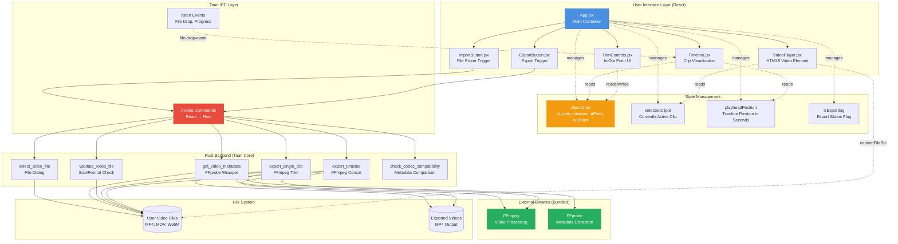

# ClipForge Architecture Diagram



## Architecture Layers

### 1. User Interface Layer (React)
- **App.jsx**: Central container managing all state and child components
- **VideoPlayer.jsx**: HTML5 `<video>` element for preview playback
- **Timeline.jsx**: Visual representation of clips with draggable playhead
- **TrimControls.jsx**: UI controls for setting in/out points on clips
- **ExportButton.jsx**: Triggers the export process with progress feedback
- **ImportButton.jsx**: Opens native file picker for video import

### 2. State Management
- **clips[]**: Array of clip objects containing:
  - `id`: Unique identifier
  - `path`: Absolute file path
  - `filename`: Display name
  - `duration`: Length in seconds
  - `width/height`: Resolution
  - `codec`: Video codec (for compatibility checks)
  - `inPoint/outPoint`: Trim boundaries
- **selectedClipId**: Currently active clip in the video player
- **playheadPosition**: Current position on timeline (in seconds)
- **isExporting**: Boolean flag to show/hide export progress UI

### 3. Tauri IPC Layer
- **invoke()**: React → Rust command invocation (async)
- **listen()**: Rust → React event streaming (file drops, progress updates)

### 4. Rust Backend (Tauri Core)
All heavy lifting and file system access happens here:
- **select_video_file**: Opens native file picker dialog
- **get_video_metadata**: Wraps FFprobe to extract duration, resolution, codec
- **validate_video_file**: Checks file size, format, and existence before import
- **export_single_clip**: Uses FFmpeg to trim a single clip
- **export_timeline**: Uses FFmpeg concat demuxer to merge multiple clips
- **check_codec_compatibility**: Compares clip codecs to warn about potential issues

### 5. External Binaries (Bundled)
- **FFmpeg**: Video processing engine (trim, concat, encode)
- **FFprobe**: Metadata extraction tool (comes with FFmpeg)
- Both bundled as Tauri "sidecars" via `externalBin` config

### 6. File System
- **Input**: User's video files (MP4, MOV, WebM formats)
- **Output**: Exported MP4 files saved to user-selected location

## Key Data Flows

### Import Flow
```
User → File Picker → validate_video_file() → get_video_metadata() → Add to clips[]
```

### Preview Flow
```
Click Clip → Update selectedClipId → VideoPlayer loads via convertFileSrc()
```

### Trim Flow
```
User Adjusts In/Out → Update Clip Object in State → VideoPlayer Seeks to New Position
```

### Export Flow
```
Click Export → Validate Clips → check_codec_compatibility() → FFmpeg (trim/concat) → Save MP4
```

## Critical Implementation Notes

1. **convertFileSrc()**: Always required to convert file paths to loadable URLs for HTML5 video element
2. **Bundled Binaries**: FFmpeg/FFprobe must be packaged as Tauri "sidecars" using `externalBin` in tauri.conf.json
3. **Error Handling**: Every `invoke()` call must be wrapped in try-catch in React
4. **Progress Feedback**: MVP uses boolean `isExporting` flag; advanced version parses FFmpeg stderr for percentage
5. **Cross-Platform Paths**: Use Rust's `PathBuf` for all path operations to handle Windows backslashes vs Unix forward slashes

## Component Responsibilities

### React Components
- Render UI and handle user interactions
- Manage application state (clips, selection, playhead)
- Display video preview and timeline visualization
- Show loading states and error messages

### Rust Backend
- Execute FFmpeg/FFprobe commands
- Handle file system access (read/write)
- Validate file formats and metadata
- Provide cross-platform file dialogs

### FFmpeg/FFprobe
- Extract video metadata (duration, resolution, codec)
- Trim clips using `-ss` and `-t` flags with `-c copy` (fast, no re-encode)
- Concatenate multiple clips using concat demuxer
- Export final video to MP4 format

## Security Considerations

- File paths are validated before passing to FFmpeg
- User can only access files through native file picker (no arbitrary path access)
- FFmpeg runs in separate process (sandboxed from main app)
- All Tauri commands require explicit whitelisting in tauri.conf.json
